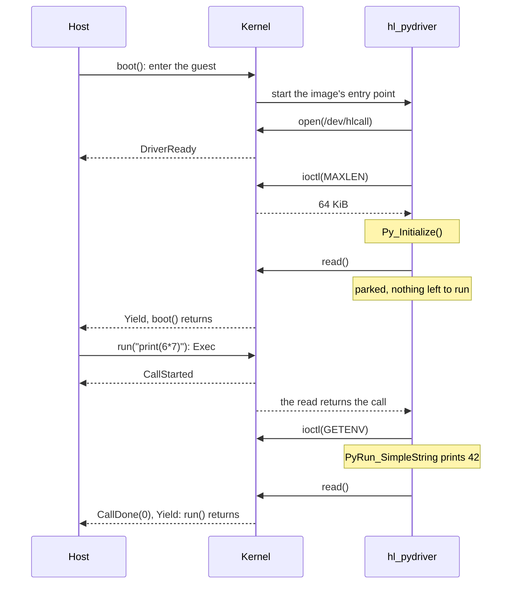

# Drivers

A driver is the program the kernel starts in a runtime image.  It brings its runtime up once, then serves the host's calls for as long as the guest lives: the python image's driver, `hl_pydriver`, starts CPython, opens `/dev/hlcall` and reads from it, and a `run("print(6*7)")` on the host comes out of that read.  Every driver under [`drivers/`](../drivers/) is the same loop around a different runtime, shared in [`hl_driver.h`](../drivers/hl_driver.h).  This page is the contract between a driver and the kernel; the host's side of the same calls is in [execution.md](execution.md).

## The device

The whole contract is one character device, `/dev/hlcall`, and six operations on it, listed in the order a driver uses them:

| Operation | Meaning |
|---|---|
| `open()` | The driver is here.  The kernel tells the host `DriverReady`; a call that arrives before any open is refused with `CallRejected`, which is what an image without a driver produces. |
| `ioctl(HLCALL_IOC_MAXLEN)` | How large a call can be, a `uint64_t` the kernel knows from the host's PEB.  The driver allocates its read buffer from it, once. |
| `read()` | Blocks until the host issues a call, then returns it whole: the FunctionCall FlatBuffer as the host encoded it.  Reading again completes the previous call. |
| `ioctl(HLCALL_IOC_GETENV)` | The variables the embedder set (`--env`, `set_env_vars`) as they are now, `KEY=VALUE` entries separated by NUL, into a buffer the driver provides.  Asked at the top of every call. |
| `ioctl(HLCALL_IOC_HOSTCALL)` | Call one of the embedder's functions (`SandboxBuilder::host_function`) by name and get its reply. The kernel forwards it as the host function `HostCall(name, args)`. Only while a call is in flight. |
| `write()` | An `int32_t` status for the call being served, optionally followed by its result, which the kernel sends as `CallResult` before `CallDone`. Written when the call failed or has a result. Refused when no call is in flight. |

The ioctl numbers, `_IOR('H', 1, uint64_t)`, `_IOWR('H', 2, struct hlcall_env)` and `_IOWR('H', 3, struct hlcall_hostcall)`, are built with the standard macros, so the argument's size is part of the number and a layout mismatch between the two sides reads as `ENOTTY`.  The kernel's `plat/hyperlight/include/hyperlight-x86/step.h` is the source of truth; `hl_driver.h` mirrors it.

## From boot to a call



`boot()` returns when the driver is parked in its first `read()`, so every call the host ever makes finds a reader waiting.  Two things complete a call: the callback returning, and the driver reading again.  The kernel reports `CallDone` at that second read, which is why the driver never says "done" explicitly.  When the callback returns is each runtime's own rule: Node when its event loop drains, so a live timer or server keeps the call open until it is cleared or `unref()`ed; an exec'd program when it exits, taking its threads with it as any process does; Python and .NET when the main code returns, so a thread it started, daemon or not, foreground or background, is left behind and makes progress on the steps that follow like any blocked guest thread.  Python and .NET differ from their standalone programs here, which wait for non-daemon and foreground threads before exiting; a long-lived interpreter cannot run the exit-time machinery that makes that safe (a module-level thread pool would hold the call forever), so the call is the main code.  What the runtime prints to stdout and stderr is the guest's output on the host.

An exit inside a call (`sys.exit()`, `process.exit()`, `Environment.Exit()`, a shell's `exit`, a program's exit code) ends the call with that status, as it would end a script.  The runtime is there for the next call: Python and Node catch the exit and keep their state; .NET and bash cannot, so the next call starts a fresh one.

A call can block.  `run("time.sleep(2)")` puts the driver thread to sleep, and to the kernel that is an ordinary blocked thread: with nothing else to run it yields, the host waits the two seconds without using CPU, re-enters, and the call goes on.  A `recv()` on a socket does the same, with the host waiting for the socket instead.  That is the step model of [execution.md](execution.md) seen from inside the driver.

## A call that fails

`run("1/0")` makes Python raise.  The callback returns 1, `hl_driver_run` writes that status to the device, and the next `read()` reports `CallDone(1)`: the host's `run()` fails with status 1 and the traceback in the output, and `step()` reports `Yield::CallFailed { status: 1 }`.  The status is the driver's to choose: a program's or an `exit()`'s own code, 1 for an uncaught exception (what the runtime's script would exit with), -1 when the driver could not run the call at all.  A call the driver reads past without a status is a success.  The kernel never waits for a write, so nothing can hang on one.

## What a call carries

`Exec` carries source: `run("print(6*7)")` arrives as `Exec` with that string as its one parameter, and the callback runs it in the runtime (an `Exec::File` is read on the host and sent the same way).  `GuestExec` carries a command line for a program already in the image: `run(Exec::Guest("/app/server --port 8080"))` arrives as `GuestExec` with that line, the callback runs the file with that argv, and an empty line runs the image's conventional entrypoint, `/entrypoint.py` in the python image.  [`hl_fc.h`](../drivers/hl_fc.h) reads the name and the parameters out of the FlatBuffer.  One call at a time: the host finishes one before it issues the next.

`Call` carries a function name and an input. `call("greet", r#"{"name":"World"}"#)` asks the driver to run the guest's `greet` and send back its result with `hl_set_result()`. A driver opts in with `hl_driver_serve_calls()`. Without it, `hl_driver_run` fails a `Call` itself, so a callback written for `Exec` never runs a function name as code. A result is at most 64 KiB; the kernel refuses a larger one and the call fails. [calls.md](calls.md) covers what each image does with a call.

## Host functions

`hl_host_call("math.add", "[2,3]", ...)` runs the embedder's `math.add` and returns 0 with its result, 1 with its error message, or -1 if the call couldn't be made (no call in flight, or a host without `HostCall`). Every embedder function travels as one host function, `HostCall(name, args)`, which the library dispatches by name, so a new function needs no kernel change. The bytes pass through untouched; the drivers use JSON. The empty name lists the registered functions, one per line.

Call it from the thread serving the call. The node and dotnet-jit runtimes are child processes, so the child sends each host function call up its pipe and the driver makes it.

## The environment

`hluk run --env GREETING="it's me"` reaches the guest as the entry `GREETING=it's me` from `HLCALL_IOC_GETENV`.  Only the embedder's variables travel this way; what the image's runtime sets for itself stays, unless the embedder sets the same key, which then wins.  Together they must fit one host call, 64 KiB by default, since the kernel fetches them with one.  [`hl_env.h`](../drivers/hl_env.h) does `setenv()` for the C side and hands each variable to the runtime: Python sets `os.environ["GREETING"]` through the C API, and bash, whose shell is a separate process fed with source, gets `export GREETING='it'\''s me'` in front of the call, quoted so the shell takes the value as it is.  A variable the embedder removed stays set in the guest.

## Snapshots

A snapshot taken while the driver is parked in `read()` is a warm image: restored, it continues from that read, and the kernel announces `DriverReady` again so the new host knows a driver is there.  A call that was in flight completes on a later step.

## Where the runtime lives

The loop is the same in every driver; what differs is where the runtime lives, and that decides how a call and the environment reach it.

Python is embedded: `hl_pydriver` and `hl_pywarmdriver` link `libpython` and run the code with `PyRun_SimpleString` in their own process, which is why those images can set `os.environ` through the C API.  `hl_quickjsdriver` embeds quickjs-ng the same way. `hl_wasmtimedriver` embeds Wasmtime and is written in Rust, with its own port of these headers in `drivers/wasmtime/driver/src/hlcall.rs`.

Node and .NET (the dotnet-jit image) ship as programs, so `hl_nodedriver` and `hl_dotnetdriver` spawn one child at boot and keep it: the child sits in a read on a pipe from the driver, gets each call as length-prefixed code, runs it and writes back its status.  Both children also take a `Call` (a function name and input) and write back its result, and send each host function call up the same pipe for the driver to make; [`hl_child.h`](../drivers/hl_child.h) has the protocol.  Kept across calls it stays warm, and a snapshot keeps it warm.  `hl_bashdriver` does the same with a BusyBox `hush`, except that the call goes into a file and the byte on the pipe says "source it".  Such a child can only be reached through the source it is fed, hence the quoted assignments in front of each call.

`hl_pwshdriver` starts a fresh `pwsh` per call, and `hl_execdriver`, behind the c, go, rust and dotnet-aot images, simply runs the program the call names, seeing its exit as EOF on a pipe.  A process spawned per call inherits `environ`, so `setenv()` alone reaches it.

## Writing one

```c
#include "hl_fc.h"
#include "hl_env.h"
#include "hl_driver.h"

static int foo_dispatch(const uint8_t *fc, size_t fc_len)
{
	size_t len;
	const char *code = fc_arg0_string(fc, fc_len, &len);

	if (!code)
		return -1;
	hl_env_refresh(NULL, NULL); /* setenv() every host variable */
	return foo_run(code, len);  /* 0 on success */
}

int main(void)
{
	if (hl_driver_init("hl_foodriver"))
		return 1;
	/* bring the runtime up */
	hl_driver_run(foo_dispatch); /* never returns: the heap and TLS must outlive each call */
}
```

Install it as `usr/bin/hl_<runtime>driver` in the image; that is where the host looks when it picks an initrd's entry point.
