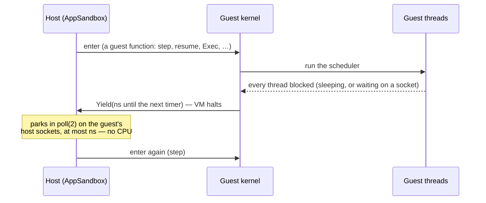
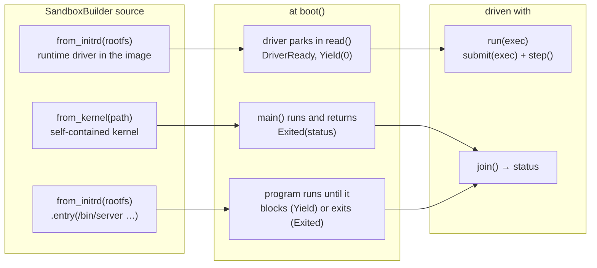
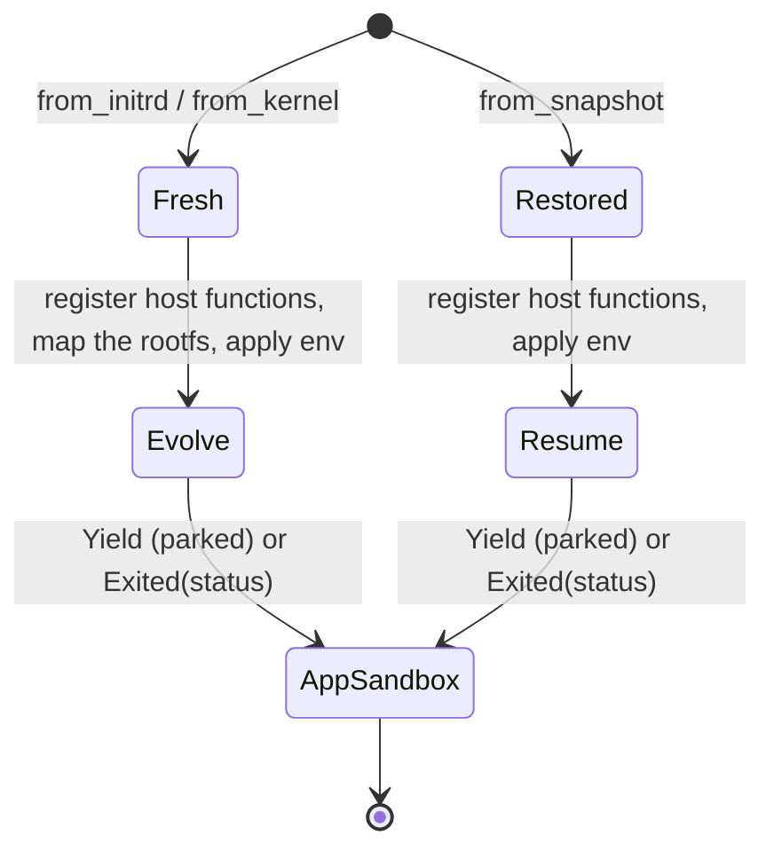
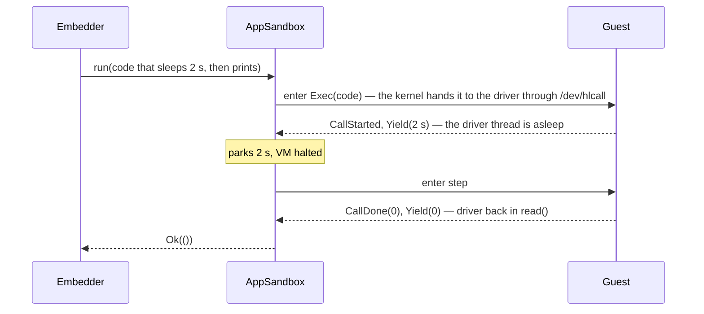
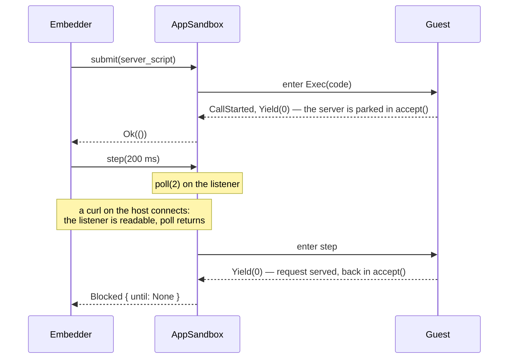
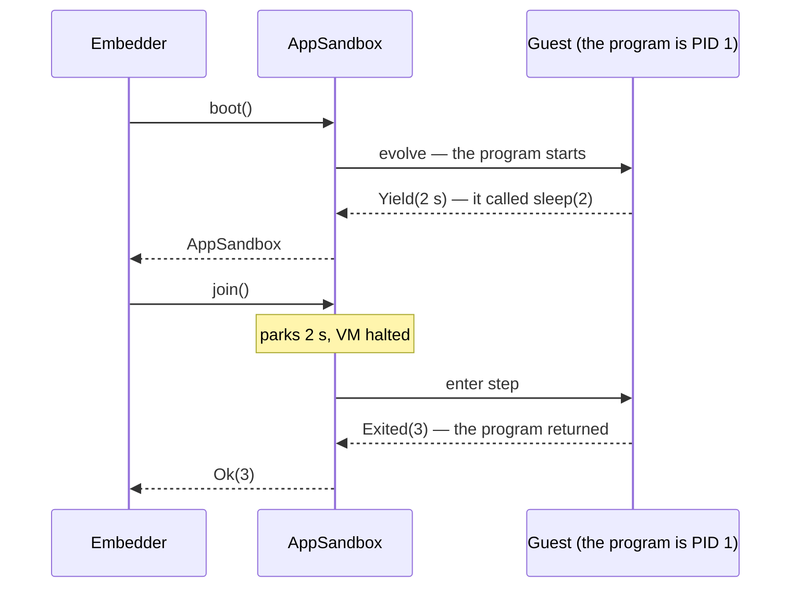
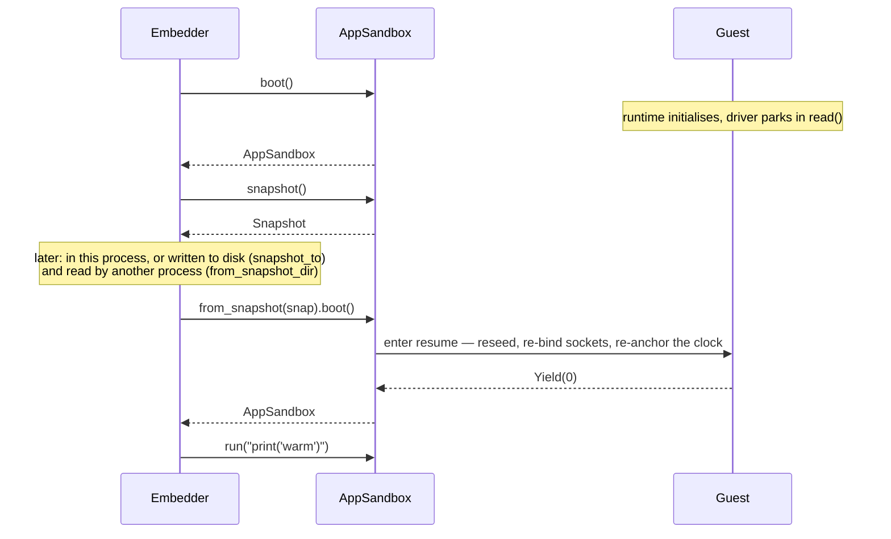

# Execution model

A guest is a Unikraft unikernel in a Hyperlight micro-VM.  The host drives it by entering the VM and getting the vCPU back at a *boundary*, of which there are two kinds: every guest thread is blocked, and the guest yields saying how long until its next timer; or the guest process has exited, and the guest reports its status.  The host waits for what the report says before entering again.  Everything in this document is a way of using that one primitive.

## The primitive: entries and boundaries

Guest memory persists across the halt: parked threads, scheduler queues, the application heap.  A snapshot taken at any boundary resumes exactly there.  The guest never spins waiting for the host; an idle guest costs nothing.

The guest reports to the host through named host functions, one fact each:

| Host function | Meaning |
|---|---|
| `Yield(ns)` | Every thread is blocked; the next timer fires in `ns` (0: none). |
| `DriverReady()` | A runtime driver opened `/dev/hlcall`: named calls are served. |
| `CallStarted()` / `CallDone(status)` | A named call was taken / returned (0: success). |
| `CallResult(bytes)` | What that call returned, when its driver sent a result; just before `CallDone`. |
| `CallRejected()` | A named call had no reader: it never ran. |
| `Exited(status)` | The guest process ended; the kernel is shutting down. |

One more host function, `HostCall(name, args)`, runs the embedder's function of that name for a driver and returns its reply ([calls.md](calls.md)).  The host folds the reports into one [`Yield`](../src/lib.rs) per entry: `Blocked { until }`, `CallDone`, `CallFailed { status }`, or `Exited { status }`.  A `Blocked` with no timer and no host socket that could wake the guest, while a call's return or a program's exit is still owed, is a deadlock: `step`, `run` and `join` return `Error::Deadlocked` rather than wait forever.

## The verbs

Everything a caller does with an [`AppSandbox`](../src/lib.rs) is one of these.  `submit` delivers work; `step` is the primitive that advances the guest; `run` and `join` are loops over `step` with a stop condition.

| Verb | Does |
|---|---|
| `SandboxBuilder::boot()` | Registers the host functions and brings the guest to its first boundary: evolves a fresh guest, or restores a snapshot and runs its `resume` entry. |
| `submit(exec)` | Hands the driver a call and returns at the first boundary, without waiting for the call to finish. Example: `submit("import http.server … serve_forever()")` returns as soon as the server is parked in `accept()`; the embedder drives it with `step` from there, and `step` reports `CallDone` if the call ever returns. |
| `step(timeout)` | Advances the guest by one boundary and returns control to the embedder. The host thread waits, with the VM halted, until the guest has something to do (a timer due, a socket ready) or `timeout` runs out. If the guest is due, the host enters the VM and the guest runs until every thread blocks again; `step` then returns why the guest stopped. If the timeout ran out first, nothing was entered and the last `Blocked` comes back.|
| `run(exec)` | `submit`, then `step` until the call returns. |
| `call(function, input)` | `run(Exec::Call { function, input })`, returning the result of a function the guest defined ([calls.md](calls.md)). |
| `join()` | `step` until the process exits, and hand back its status. |
| `snapshot()` / `snapshot_to(dir)` | Captures the guest at the current boundary, a call in flight included; `snapshot_to` also writes it to a directory. |
| `restore(snapshot)` / `restore_from(dir)` | Replaces the guest with the snapshot in place and runs its `resume` entry. |

## Three kinds of guest

A snapshot (`from_snapshot`) brings back any of the three at the boundary it was taken, and is driven the same way afterwards; see `boot()` below.

- **Native kernel** (`from_kernel`): no rootfs, no driver.  Its `main()` runs during `boot()`; the kernel reports the exit status on the way down, and `join()` returns it without another entry.  `hluk run --kernel` is this.  (A native kernel that does multitask parks with a `Yield` instead, and is driven like the entry-point program below.)
- **Driver image** (`from_initrd` with `hl_pydriver`, `hl_nodedriver`, …): the auto-detected entry point is a driver that boots a runtime and waits for calls.  `boot()` returns when the driver is parked; nothing runs until a call is dispatched.
- **Entry-point program** (`from_initrd` + `.entry(...)`): the program is the workload.  There is no one to dispatch to; `join()` keeps it going until it exits.  This is how a container runtime runs a server in the guest, and what `hluk run --entry` does.
- **Snapshot** (`from_snapshot`, or `from_snapshot_dir` from disk): any of the above, captured at a boundary.  `boot()` announces the restore with a `resume` entry (next section), then the guest continues where it was: a driver image goes on with `run` or `submit` + `step` (a call in flight at the snapshot finishes on a later `step`, reporting `CallDone`), a program or a native kernel with `join`.

## What `boot()` does

Either lane ends with the guest parked at a boundary (a `Yield`: the driver is waiting, or the program is blocked) or already exited (an `Exited`: the program or the kernel's `main()` ran to completion; every later step reports it again).

`resume` runs guest code: after the kernel's own work — reseeding the CSPRNG, re-binding the host sockets, re-anchoring the wall clock — it drives the scheduler to the next boundary, exactly as a `step` would.  Threads woken by a connection that died with the old host (a server's `recv` returning EOF) run there, and so does any timer that came due.  Nothing is dispatched.

## Driving a driver image: `run`, or `submit` + `step`

### `run`

`run` delivers the call and steps until it returns; the embedder sees nothing in between:

### `submit` + `step`

`submit` delivers the same call but returns at the first boundary, here with the server parked in `accept()`.  From then on the embedder steps.  A client's request wakes the step at once: the host owns the listening socket, so the connection completes in the host OS, the listener becomes readable, the host's `poll(2)` returns and the guest is entered.

`run` does exactly this too, with the loop inside `run`: it keeps stepping, requests are served the same way, and it returns when the script returns.  The one difference is who holds the loop.  With `submit` + `step` the embedder does, so it can act between two steps: snapshot in the middle of the call, or do work of its own.

## Driving an entry-point image: `join`

`join` is for an image with no driver: its entry point is the workload itself, a program baked into the rootfs (`.entry("/bin/server")`).  There is no one to send code to, so `join` steps until the program exits and returns its status.  It is `run`'s step loop without the `submit`, stopping on `Exited` instead of `CallDone`.  For a program that sleeps 2 s and then exits with 3:

A server is the same: `join` parks on its listener between requests and returns when the server exits.  A program that finishes during `boot()` (the C `hello` and `status` examples) has `join` return at once.  `hluk run --entry` is this, and exits with the same status.  `join` on a driver image is an error: a driver waiting for calls never exits.

## Snapshot and restore

A snapshot can be taken at any boundary, and a restored guest continues from exactly there.  Two boundaries are worth naming.

**After boot, for a warm start.**  With a driver image, `boot()` returns once the runtime is initialised and the driver is parked: the interpreter is up, and in the `agent` image the heavy imports are already done.  A snapshot there is a warm image; every guest restored from it skips that work.

**In the middle of a call, with `submit` + `step`.**  A snapshot taken between two steps captures the call in flight; the restored guest finishes it and reports `CallDone` on a later step.

A snapshot loads under any build with the same *snapshot key*, `SNAPSHOT_KEY` (`hluk snapshot key`): the embedded kernel's hash and a host contract number, the two things a snapshot depends on.  A release that changes neither keeps every saved snapshot; one that does refuses them with `Error::SnapshotRelease`, which names the release that saved the snapshot and says to save it again.

On `resume` the guest puts itself right for the new host: its hostfs mounts are made to match what the host serves (it fetches the list through `GetMounts`; see [fs.md](fs.md)), sockets are opened and bound again, connections whose peers died with the old host read as closed, the CSPRNG is reseeded (see [random.md](random.md)) and the wall clock re-anchored (see [clock.md](clock.md)).  The embedder supplies what lives on its side: the mounts, the listen ports, and any environment.  `restore(snap)` does the same in place, on an existing `AppSandbox`.
